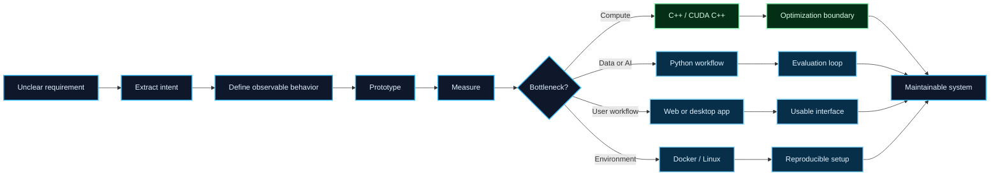

<!--
  Profile README for LALA-K
  Repository: LALA-K/LALA-K
-->

 

 

  
  
  
  
  
  

  
  
  

 

  

I am a software engineer who builds practical software across performance-sensitive implementation, data and AI workflows, web applications, desktop tools, and Linux-based environments.

I often work under incomplete requirements, unfamiliar technology, or short delivery windows. My approach is to clarify the expected behavior first, separate assumptions from facts, build a small verifiable path, and then improve the system through debugging, measurement, and review.

A concrete optimization case reduced a long-running process from roughly two hours to under two minutes end-to-end. When excluding input/output and measuring the compute path, the same work reached roughly ten seconds. I include the measurement boundary because performance claims are only useful when the measured scope is explicit.

My academic background is in second language acquisition. I studied motivation among Japanese language learners through interviews and participant observation, then analyzed factors that maintain, improve, or reduce motivation. This connects with my interest in language learning support, feedback design, and AI-assisted writing tools.

 

  

| Area | What I use it for |
| --- | --- |
| **C++ / CUDA C++** | Performance-sensitive implementation, GPU acceleration, benchmark design, compute and I/O boundary separation, memory-aware optimization |
| **Python** | Data analysis, machine learning experiments, NLP/CV workflows, automation, prototype-to-evaluation loops |
| **Applications** | Django, React/TypeScript, tkinter, C#, databases, report output, frontend implementation, OSS modification |
| **Systems** | Docker-connected environments, Linux development, ROS-related work, device/control-adjacent workflows, Git-based collaboration |

 

  

  
  
  
  

I have worked on software where the answer was not available as a ready-made example: connecting Docker-based environments, shaping Django and React/TypeScript application behavior, developing C# business applications with database and report output, and building tools that reduce repetitive training and review work.

My systems experience includes Linux-based development, ROS-related workflows, device-input integration, and robotics-related software workflows. These tasks required understanding not only code, but also data flow, environment constraints, runtime behavior, and failure points.

My performance-oriented work includes CUDA C++ acceleration, where a long-running process was reduced from roughly two hours to under two minutes end-to-end, and to roughly ten seconds when isolating the compute path from I/O. I treat this distinction as important because optimization is only meaningful when the measured boundary is explicit.

My visual and data-oriented work includes computer vision experiments involving feature matching, tracking, and change detection. These experiences connect Python-based experimentation with the need for C++ or CUDA C++ when computation becomes the bottleneck.

I have also supported other engineers and created learning infrastructure, including C++ training assignments and automated grading workflows. That experience shaped how I write software: it should run, but it should also be understandable, reviewable, and maintainable by the next person.

 

  

 

  

  
  
  
  
  
  
  

I am interested in natural language processing, data analysis, machine learning, artificial intelligence, computer vision, quantization, and autonomous-system technologies. These interests are connected by one practical question: how can software convert ambiguous, noisy, or high-dimensional information into feedback that people can actually use?

A long-term theme I want to build toward is writing correction and feedback software for language learners. I am interested not only in whether an LLM can correct a sentence, but also in whether the feedback is understandable, whether it supports motivation, whether the explanation fits the learner's level, and whether the tool helps people continue learning over time.

My interest in AI is practical rather than decorative. I want to use models where they can improve real workflows: language feedback, data analysis, visual understanding, automation, and developer support. As LLMs become more accurate, lighter, and easier to integrate, I think language-learning tools can become much more useful than traditional rule-based correction alone.

I am also interested in computer vision and autonomous-system-adjacent technologies, especially feature extraction, matching, tracking, change detection, and the bridge between Python-based experimentation and C++/CUDA-based acceleration. That combination is attractive because it connects research-style exploration with implementation that can run within practical time constraints.

**Current directions I care about:**

- AI-assisted writing correction and language-learning feedback
- Practical LLM integration for developer support and workflow automation
- Computer vision, feature matching, tracking, and change detection
- Efficient inference, quantization, and local AI execution
- Python-first experimentation that can later move toward C++ or CUDA acceleration

 

<strong>Full Technical Stack</strong>

 

A compact, theme-based overview of my technical stack.

<h3>Core Languages &amp; Markup</h3>

<h3>Web &amp; Application Development</h3>

<h3>Data, AI &amp; Databases</h3>

<h3>Cloud, DevOps &amp; Version Control</h3>

<h3>Systems, Robotics &amp; Platforms</h3>

<h3>Tools &amp; Community</h3>

 

  

  

  
  

  

  Public GitHub cards are partial signals. They do not fully represent private work, professional impact, or actual skill depth.

 

  

  
  

 

 
<strong>Carpe Diem. Quod tango muto.</strong>
 
<strong>From ambiguity to implementation. From measurement to change.</strong>
 

